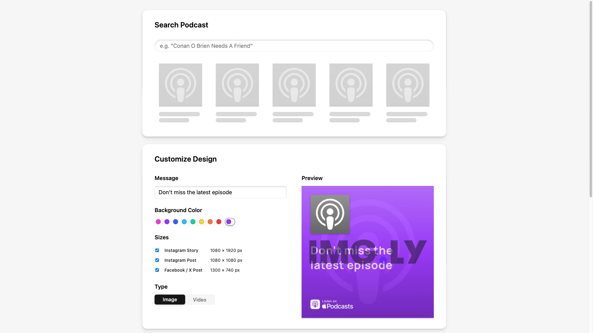

# Automatic Design Generation Starter Kit

Generate social media assets programmatically from content. Supports multiple sizes, image and video output, with built-in editing previews. Built with [CE.SDK](https://img.ly/creative-sdk) and React by [IMG.LY](https://img.ly), runs entirely in the browser with no server dependencies.

<p>
  <a href="https://img.ly/docs/cesdk/starterkits/design-generation/">Documentation</a> |
  <a href="https://img.ly/showcases/cesdk">Live Demo</a>
</p>



## Getting Started

### Clone the Repository

```bash
git clone https://github.com/imgly/starterkit-automatic-design-generation-react-web.git
cd starterkit-automatic-design-generation-react-web
```

### Install Dependencies

```bash
npm install
```

### Download Assets

CE.SDK requires engine assets (fonts, icons, UI elements) served from your `public/` directory.

```bash
curl -O https://cdn.img.ly/packages/imgly/cesdk-js/$UBQ_VERSION$/imgly-assets.zip
unzip imgly-assets.zip -d public/
rm imgly-assets.zip
```

### Run the Development Server

```bash
npm run dev
```

Open `http://localhost:5173` in your browser.

## Configuration

### Customizing Generation

The generation workflow is orchestrated through React hooks in `src/app/hooks/`:

```typescript
// Control podcast search
const { searchResults, handlePodcastSelect } = usePodcastSearch();

// Customize design options
const { message, backgroundColor, outputType } = useCustomization();

// Generate assets with the CE.SDK engine
const { generateAssets, finalAssets } = useAssetGeneration();
```

### Theming

```typescript
cesdk.ui.setTheme('dark'); // 'light' | 'dark' | 'system'
```

See [Theming](https://img.ly/docs/cesdk/web/ui-styling/theming/) for custom color schemes and styling.

### Localization

```typescript
cesdk.i18n.setTranslations({
  de: { 'common.save': 'Speichern' }
});
cesdk.i18n.setLocale('de');
```

See [Localization](https://img.ly/docs/cesdk/web/ui-styling/localization/) for supported languages and translation keys.

## Architecture

```
starterkit-automatic-design-generation-react-web/
├── src/
│   ├── index.tsx             # React entry point
│   └── app/
│       ├── App.tsx               # Main app component
│       ├── hooks/
│       │   ├── useEngine.ts          # CE.SDK engine lifecycle
│       │   ├── useAssetGeneration.ts # Asset generation logic
│       │   ├── useCustomization.ts   # Design customization state
│       │   ├── usePodcastSearch.ts   # Content search
│       │   ├── useEditorModal.ts     # Editor modal state
│       │   └── useGenerationWorkflow.ts # Workflow orchestration
│       ├── CustomizationPanel/   # Design options UI
│       ├── GeneratedAssets/      # Asset grid and cards
│       ├── EditorModal/          # Full-screen editor
│       └── Preview/              # Live preview component
│   └── imgly/
│       ├── index.ts              # CE.SDK exports
│       ├── design/               # Design editor configuration
│       │   ├── plugin.ts             # Main plugin
│       │   ├── actions.ts            # Export/save actions
│       │   ├── features.ts           # Feature toggles
│       │   └── ui/                   # UI customization
│       └── video/                # Video editor configuration
│           └── ...                   # Same structure as design/
├── public/                   # Static assets and icons
├── package.json
└── vite.config.ts
```

## Key Capabilities

- **Multi-Size Generation** – Generate assets in multiple sizes simultaneously
- **Image & Video Output** – Switch between static and animated output
- **Built-in Preview** – Edit generated designs with the full CE.SDK editor
- **Template-Based Design** – Start from templates with content swapping
- **Batch Export** – Download all selected sizes at once
- **Client-Side Processing** – All generation happens in the browser

## Prerequisites

- **Node.js v20+** with npm – [Download](https://nodejs.org/)
- **Supported browsers** – Chrome 114+, Edge 114+, Firefox 115+, Safari 15.6+
- **Video output** – Chromium-based browsers only

## Troubleshooting

| Issue | Solution |
|-------|----------|
| Editor doesn't load | Verify assets are accessible at `baseURL` |
| Assets don't appear | Check `public/assets/` directory exists |
| Watermark appears | Add your license key |
| Video not available | Use Chrome, Edge, or another Chromium browser |

## Documentation

For complete integration guides and API reference, visit the [Automatic Design Generation Documentation](https://img.ly/docs/cesdk/starterkits/design-generation/).

## License

This project is licensed under the MIT License - see the [LICENSE](LICENSE) file for details.

---

<p align="center">Built with <a href="https://img.ly/creative-sdk?utm_source=github&utm_medium=project&utm_campaign=starterkit-design-generation">CE.SDK</a> by <a href="https://img.ly?utm_source=github&utm_medium=project&utm_campaign=starterkit-design-generation">IMG.LY</a></p>
